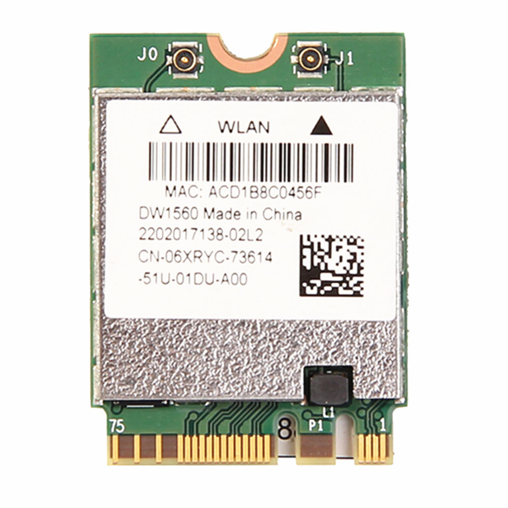

# ASUS-ROG-GL753VE-GC004T-Hackintosh
ASUS ROG GL753VE Laptop EFI, etc... files used to run Mac OS.
Repository contains kexts, configs, acpi patches applied to run different MacOS versions
on my laptop.

## Hardware

### WiFi

I replaced native Intel WiFi module with [DW1560 BCM94352Z NGFF M.2](https://ru.aliexpress.com/item/32862859069.html)


## Software 

### BIOS-308-MACOS-10.14

MacOS 10.14 (Mojave) and Laptop BIOS version is 306.

Works:

 * Video HD630
 * Bluetooth
 * WiFi
 * Trackpad
 * Sound
 * USB
 * Display brightness, Sound and sleep (zzzz) FN keys

NOTE: Properly install kexts to specified locations.

NOTE: Do not forget to set serial numbes in [config.plist](BIOS-308-MACOS-10.14/EFI/EFI/config.plist) instead of XXXXXX....

### BIOS-306-MACOS-10.13

MacOS 10.13 and Laptop BIOS version is 306.

Works:

 * Video HD630
 * Bluetooth
 * WiFi
 * Trackpad
 * Sound
 * USB

Should be removed:

 * *AppleIntelLpssI2C.kext*, *AppleIntelLpssI2CController.kext* from */System/Library/Extensions* (do not forget rebuild kext cache: ```sudo kextcache -i /```)

## P.S.
Goog luck!!!
